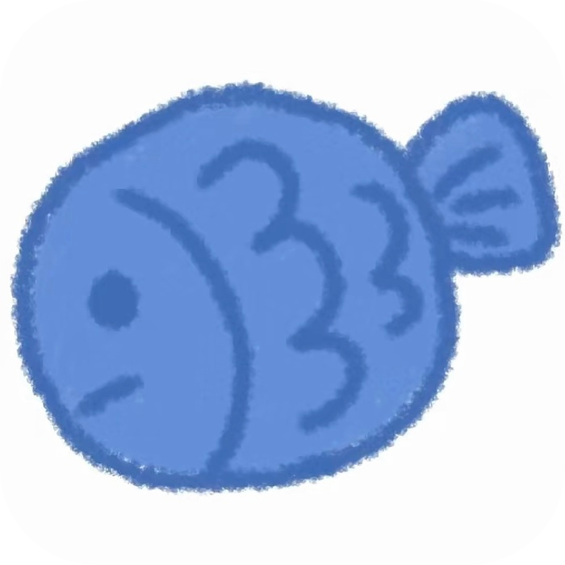

<div align="center">
    
  <h1>GameOptimizer Pro</h1>
  <h3>Windows游戏性能优化工具箱</h3>
</div>

<p align="center">
    <!-- 支持赞助 -->
    <a href="https://buymeacoffee.com/oslook" target="_blank"></a>
    <!-- 核心徽章组 -->
    <a href="https://github.com/vdavidyang/GameOptimizerPro/releases" target="_blank"></a>
    <a href="LICENSE" target="_blank"></a>
	<!-- 平台支持 -->
    </p>
<p align="center">
    
    <a href="https://github.com/vdavidyang/GameOptimizerPro/releases" target="_blank"></a>
    <a href="https://github.com/vdavidyang/GameOptimizerPro/issues" target="_blank"></a></p>

<p align="center">
    <!-- 开发状态徽章组 -->
    <a href="https://github.com/vdavidyang/GameOptimizerPro/actions" target="_blank"></a>
    <a href="https://github.com/vdavidyang/GameOptimizerPro/commits/main" target="_blank"></a>
<!-- 专业深色系 -->
</p>

<p align="center">
    <!-- 代码质量徽章组 -->
    <a href="https://github.com/vdavidyang/GameOptimizerPro" target="_blank"></a>
    <a href="https://github.com/vdavidyang/GameOptimizerPro" target="_blank"></a>
    <a href="https://github.com/vdavidyang/GameOptimizerPro/actions/workflows/codeql.yml" target="_blank"></a></p>

<p align="center">
    <!-- 社区徽章组 -->
    <a href="https://discord.gg/your-invite-link" target="_blank"></a>
    <a href="https://t.me/your-channel" target="_blank"></a></p>

<div align="center">
    <p>🎮 为Windows游戏玩家打造的性能加速神器 | 基于GPL 3.0开源协议 ✨</p>
</div>
## 🔍 项目简介

GameOptimizer Pro 是专为PC游戏玩家设计的系统级优化工具，通过智能调整系统资源分配、进程优先级和网络设置，显著提升游戏帧率稳定性，降低卡顿和延迟，支持Windows 10/11系统。

**技术特性**：

- 基于Qt 6框架开发 
- 支持Windows 10/11 (x64) 
- 非侵入式优化（不修改游戏文件）
- 低系统资源占用（<1% CPU）

## ⚡ 核心功能

### 🚀 核心优化 

- 进程优先级动态调整

- CPU核心亲和性优化

- 自动限制反作弊进程

- 游戏线程调度优先级提升

- 游戏运行时自动限制后台程序资源占用

### ⚡ 系统优化

- 高性能电源计划切换

- 非必要系统服务禁用

- 调度优化，提升游戏进程的线程调度优先级

### 🌐 网络优化

- TCP/Nagle算法优化，加速TCP传输

## 📦 安装指南

### 二进制安装

1. 从[Release页面](https://github.com/vdavidyang/GameOptimizerPro/releases)，下载最新安装包
2. 运行 `GameOptimizerPro_Setup.exe`
3. 按向导完成安装

```powershell
# 静默安装命令（管理员权限）
Start-Process "GameOptimizerPro_Setup.exe" -ArgumentList "/S" -Verb RunAs
```

## 🚦 快速使用

1. 启动程序（自动最小化到系统托盘）
2. 右键托盘图标 → 打开控制面板
3. 配置优化方案：
   - 基础优化：电源模式+进程调度
   - 高级优化：网络+后台抑制+自动限制反作弊
4. 启动游戏享受流畅体验

## 🔨 构建指南

### 环境要求

- Visual Studio 2022 (MSVC)
- Qt 6.8.3 (Desktop)
- CMake 3.25+
- Windows SDK 10.0.22621+
- NSIS 3.0+

```
git clone https://github.com/vdavidyang/GameOptimizerPro.git
cd GameOptimizerPro
cmake -B build -DCMAKE_PREFIX_PATH="你的Qt安装路径"
cmake --build build --config Release
```

## ⚠️ 注意事项

1. 需要以管理员权限运行
3. 建议关闭其他优化软件避免冲突
4. 修改系统服务前请创建还原点

## ❓ 常见问题

### 🔒 安全性

**Q: 会被封号吗？**
A: 完全安全，仅调整系统调度规则，不修改游戏文件，本人长期实测

**Q：杀毒软件报毒？** 
A：因涉及注册表修改，部分杀软可能误报，请添加信任或[查看源码](src/)验证安全性。  

### ❓ 优化效果

**Q: 帧率提升幅度如何？**
A: 多数用户反馈有效，实测可提升10-30%帧率稳定性，具体效果因硬件配置而异

### 📈 其他问题

**Q：支持Steam等平台吗？**
A：理论上支持所有Windows平台的游戏进程

## 🤝 贡献指南

我们欢迎以下类型的贡献：

- 代码改进（通过Pull Request）

- 文档完善（包括多语言翻译）

- 测试用例补充

- 性能优化建议

请先阅读[贡献指南](./docs/contributions.md)后再提交PR

## ⚠️ 免责声明

本程序仅供学习和技术研究使用，作者不对使用此程序导致的任何后果负责。使用本程序即表示您已了解并接受相关风险。

## 📧 联系作者

📧 Email: vdavidyang@gmail.com

🐛 [提交Issue](https://github.com/vdavidyang/GameOptimizerPro/issues)

## 📜 开源协议

本项目采用 **GPL-3.0** 开源协议，二次开发请遵守：

- 保留原始版权声明
- 公开修改后的源代码
- 不得用于商业闭源项目

完整协议文本见[LICENSE](./LICENSE)文件。